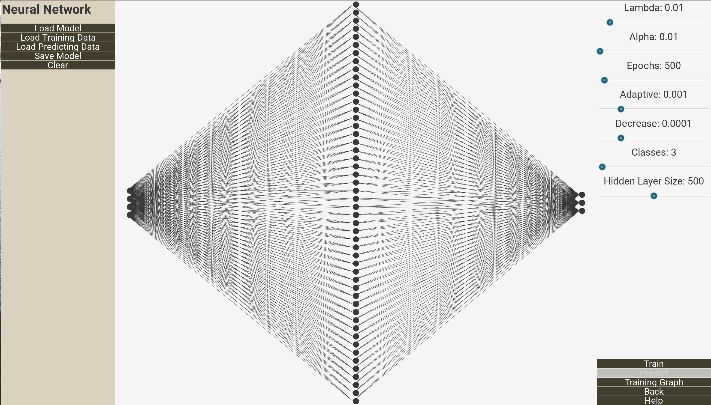
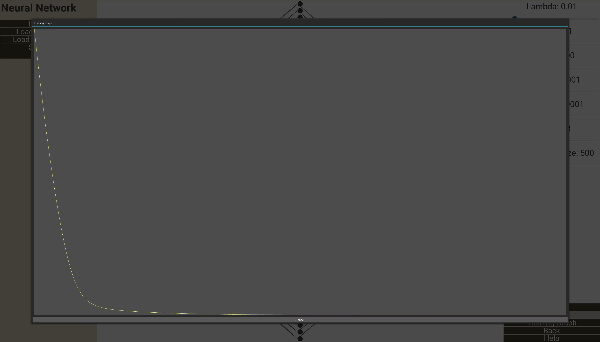

# Machine Learning Demo #

A GUI application demonstrating different Machine Learning algorithms and models with visual representations of them.

This application goes alongside my Machine learning library located at https://github.com/jamalmoir/ml_components

**IMPLEMENTED**
- Main screen

**TODO**
- Neural Network GUI
- Decision Tree GUI

**ROADMAP**
- ~~Create the main screen~~
- ~~Create the Neural Network screen without function~~
- ~~Create the Decision Tree screen without function~~
- Add functionality to Neural Network screen
- Add functionality to Decision Tree screen

## IMAGES ##

